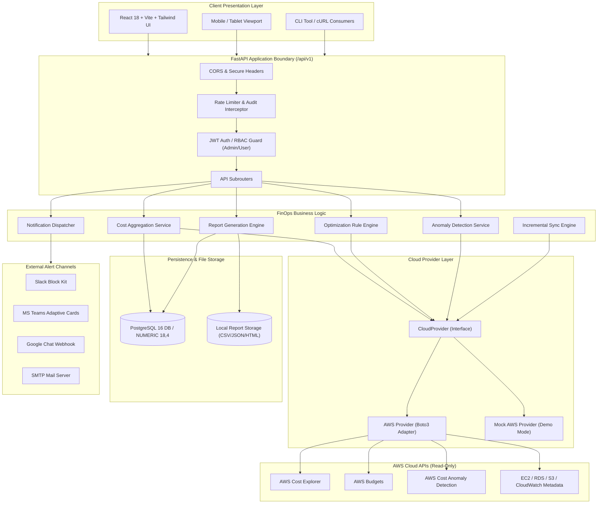
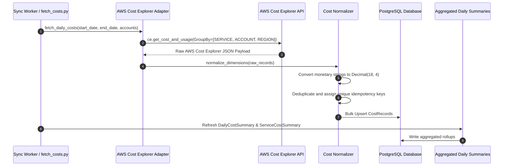
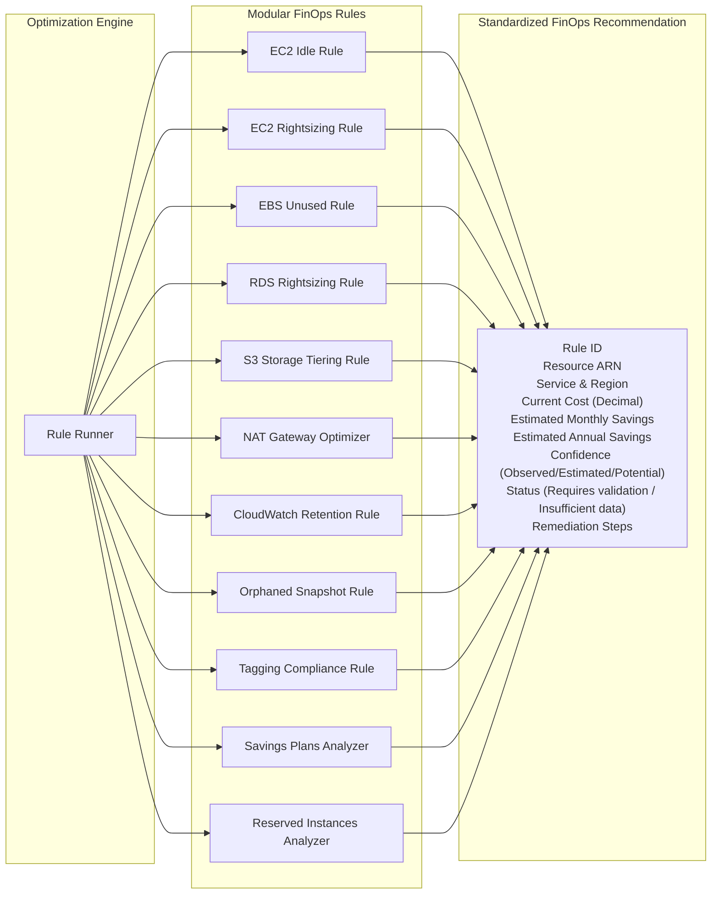
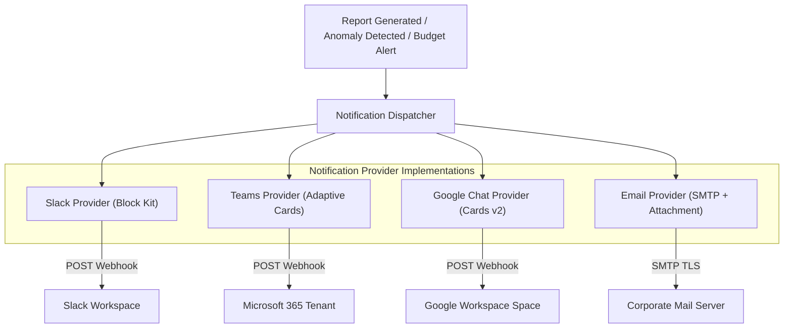
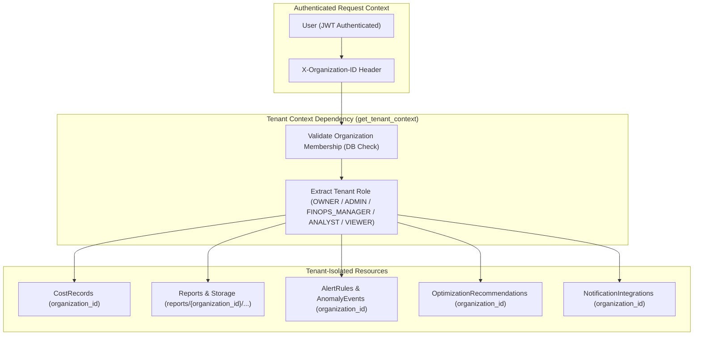
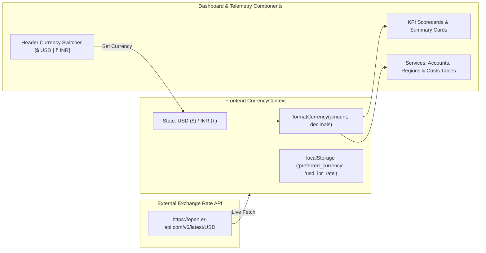

# System Architecture Specification

## Overview

The **AWS Cost Intelligence** platform (`cloud-cost-intelligence`) is designed for resilient, scalable, multi-account FinOps monitoring, optimization, reporting, and alerting. It isolates external cloud vendor APIs from consumption layers using a strict **Cloud Provider Abstraction**.

---

## 1. High-Level Architecture Diagram

---

## 2. AWS Data Ingestion & Normalization Flow

---

## 3. Cost Optimization Engine Architecture

The optimization engine evaluates infrastructure metadata against FinOps efficiency rules. Rules return a standardized `Recommendation` object:

---

## 4. Multi-Channel Notification Workflow

---

## 5. Multi-Tenant Architecture & Data Isolation

---

## 6. Security & Isolation Principles

1. **Decoupled Provider Interface**: The core application logic does not contain `import boto3` directly. All AWS SDK interactions occur strictly inside `app/providers/aws/`.
2. **Server-Enforced Multi-Tenancy**: Every authenticated request passes through `get_tenant_context` which validates active membership in `organization_members`. Requests without authorized tenant membership return `403 Forbidden`. Frontend-supplied tenant IDs are never trusted without DB validation.
3. **Centralized RBAC & Permission Matrix**: Organization access is governed by 5 distinct roles (`OWNER`, `ADMIN`, `FINOPS_MANAGER`, `ANALYST`, `VIEWER`). Granular permissions are declared in `app/auth/permissions.py` and enforced via `RequirePermission(PERM_NAME)` dependency guards.
4. **Session Management & Token Revocation**: Active user sessions are tracked in `user_sessions` with device and IP metadata. Refresh tokens are hashed in DB (SHA-256) and support instantaneous single-session (`DELETE /auth/sessions/{id}`) or global session revocation (`POST /auth/logout-all`).
5. **Owner & Role Escalation Protection**: The system prevents demoting or removing the last organization `OWNER`. Users cannot escalate their own privileges or grant roles exceeding their own role level.
6. **Zero-Trust Report Downloads & Path Traversal Prevention**: Download endpoints validate tenant ownership (`organization_id`), verify file existence within sanitized `output_base` boundaries (`resolve_safe_file_path`), and stream files safely to prevent cross-tenant data leakage or directory traversal.
7. **Financial Precision**: No binary floating-point types (`float`) are permitted for currency values in database tables or financial operations. All calculations use Python `decimal.Decimal` and PostgreSQL `NUMERIC(18, 4)`.
8. **Defensive HTTP Security & Hardened CORS**: FastAPI middleware enforces `X-Content-Type-Options: nosniff`, `X-Frame-Options: DENY`, `X-XSS-Protection: 1; mode=block`, `Referrer-Policy: strict-origin-when-cross-origin`, `Permissions-Policy`, and `Strict-Transport-Security (HSTS)`. CORS methods and headers are explicitly whitelisted.
9. **Password Complexity & Strength Enforcement**: Passwords must contain a minimum of 8 characters, with at least 1 uppercase letter, 1 lowercase letter, 1 digit, and 1 special character.
10. **Guarded Route Navigation & Production Demo Control**: `PublicOnlyRoute` protects public authentication views from flickering for logged-in users. Quick Demo credentials are hidden in production unless `DEMO_MODE=true` or explicitly requested via `?demo=true`.

---

## 7. Security Permission Matrix

| Capability | OWNER | ADMIN | FINOPS_MANAGER | ANALYST | VIEWER |
| :--- | :---: | :---: | :---: | :---: | :---: |
| **organization.read** | YES | YES | YES | YES | YES |
| **organization.update** | YES | YES | NO | NO | NO |
| **members.read** | YES | YES | YES | YES | YES |
| **members.invite** | YES | YES* | NO | NO | NO |
| **members.update** | YES | YES* | NO | NO | NO |
| **members.remove** | YES | YES* | NO | NO | NO |
| **aws_accounts.read** | YES | YES | YES | YES | YES |
| **aws_accounts.manage** | YES | YES | NO | NO | NO |
| **costs.read** | YES | YES | YES | YES | YES |
| **costs.export** | YES | YES | YES | YES | NO |
| **reports.read** | YES | YES | YES | YES | YES |
| **reports.create** | YES | YES | YES | YES | NO |
| **reports.download** | YES | YES | YES | YES | NO |
| **reports.delete** | YES | YES | NO | NO | NO |
| **optimization.read** | YES | YES | YES | YES | YES |
| **optimization.manage** | YES | YES | YES | NO | NO |
| **alerts.read / budgets.read** | YES | YES | YES | YES | YES |
| **alerts.manage / budgets.manage** | YES | YES | YES | NO | NO |
| **integrations.manage** | YES | YES | NO | NO | NO |
| **settings.update** | YES | YES | NO | NO | NO |

*\*Role escalation protection prevents ADMIN from inviting or promoting users to OWNER role. The last organization OWNER cannot be removed or demoted.*

---

## 8. Multi-Currency Telemetry & Real-Time Exchange Rates

The platform provides seamless multi-currency display capabilities for global FinOps teams:

1. **Live Exchange Rate Engine**: Fetches real-time USD/INR rates from Open Exchange Rates API (`open.er-api.com`) with caching in `localStorage` (`usd_inr_rate`) and fallback rate `83.5`.
2. **Global Telemetry Formatting**: `formatCurrency()` formats numbers according to `en-IN` (Indian Rupees `₹`) or `en-US` (US Dollars `$`) locale standards.
3. **One-Click Header Switcher**: Header component features an interactive `[$ USD | ₹ INR]` switcher with live rate tooltips.

