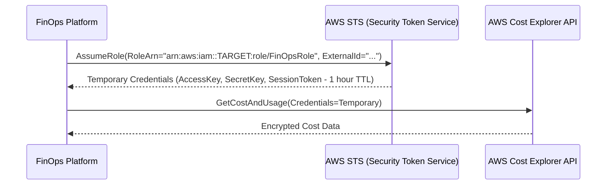

# AWS Integration & IAM Security Architecture

## Overview

The platform interacts with AWS via the **AWS Provider Adapter** (`backend/app/providers/aws/`). To adhere to security best practices, the platform **never requires write permissions** or root administrator access.

---

## Preferred IAM Architecture: Cross-Account Role Assumption

Rather than storing long-lived AWS Access Keys (`AKIA...`), the production architecture utilizes **STS AssumeRole** with an **External ID**.



---

## 1. Target AWS Account IAM Policy (`FinOpsReadOnlyPolicy`)

Attach this policy to the role assumed in each monitored AWS account:

```json
{
  "Version": "2012-10-17",
  "Statement": [
    {
      "Sid": "CostExplorerReadOnly",
      "Effect": "Allow",
      "Action": [
        "ce:GetCostAndUsage",
        "ce:GetCostAndUsageWithResources",
        "ce:GetDimensionValues",
        "ce:GetCostForecast",
        "ce:GetAnomalies",
        "ce:GetAnomalySubscriptions",
        "ce:GetAnomalyMonitors",
        "ce:GetSavingsPlansUtilization",
        "ce:GetSavingsPlansCoverage",
        "ce:GetReservationUtilization",
        "ce:GetReservationCoverage"
      ],
      "Resource": "*"
    },
    {
      "Sid": "BudgetsReadOnly",
      "Effect": "Allow",
      "Action": [
        "budgets:ViewBudget",
        "budgets:DescribeBudgets",
        "budgets:DescribeBudgetPerformanceHistory"
      ],
      "Resource": "*"
    },
    {
      "Sid": "EC2AndEBSOptimizationMetadata",
      "Effect": "Allow",
      "Action": [
        "ec2:DescribeInstances",
        "ec2:DescribeVolumes",
        "ec2:DescribeSnapshots",
        "ec2:DescribeAddresses",
        "ec2:DescribeNatGateways"
      ],
      "Resource": "*"
    },
    {
      "Sid": "RDSOptimizationMetadata",
      "Effect": "Allow",
      "Action": [
        "rds:DescribeDBInstances"
      ],
      "Resource": "*"
    },
    {
      "Sid": "S3OptimizationMetadata",
      "Effect": "Allow",
      "Action": [
        "s3:ListAllMyBuckets",
        "s3:GetBucketLocation",
        "s3:GetBucketLifecycleConfiguration"
      ],
      "Resource": "*"
    },
    {
      "Sid": "CloudWatchLogRetentionMetadata",
      "Effect": "Allow",
      "Action": [
        "logs:DescribeLogGroups"
      ],
      "Resource": "*"
    },
    {
      "Sid": "OrganizationsReadOnly",
      "Effect": "Allow",
      "Action": [
        "organizations:DescribeOrganization",
        "organizations:ListAccounts"
      ],
      "Resource": "*"
    }
  ]
}
```

---

## 2. Trust Relationship Policy

The monitored role trust policy specifies which entity is permitted to assume it, enforcing the **External ID**:

```json
{
  "Version": "2012-10-17",
  "Statement": [
    {
      "Effect": "Allow",
      "Principal": {
        "AWS": "arn:aws:iam::MANAGEMENT_ACCOUNT_ID:role/FinOpsPlatformRunnerRole"
      },
      "Action": "sts:AssumeRole",
      "Condition": {
        "StringEquals": {
          "sts:ExternalId": "finops-cost-intelligence-access-2026"
        }
      }
    }
  ]
}
```

---

## 3. Cost Explorer Operational Caveats

1. **Cost Explorer API Costs**: Each AWS Cost Explorer API request costs \$0.01 per paginated call. The platform mitigates this by:
   - Synchronizing cost data incrementally via `scripts/fetch_costs.py`.
   - Caching daily aggregated summaries in PostgreSQL.
   - Serving UI requests directly from local database tables rather than polling Cost Explorer on every page refresh.
2. **Data Freshness**: AWS Cost Explorer updates data up to 3 times per day (approximately every 8–12 hours). The platform displays a **Data Freshness** badge indicating the last synchronization timestamp.
3. **Region Endpoint**: AWS Cost Explorer and AWS Budgets are global services whose API endpoints resolve strictly through `us-east-1`. The adapter automatically defaults to `us-east-1` for these calls regardless of the selected resource region.

