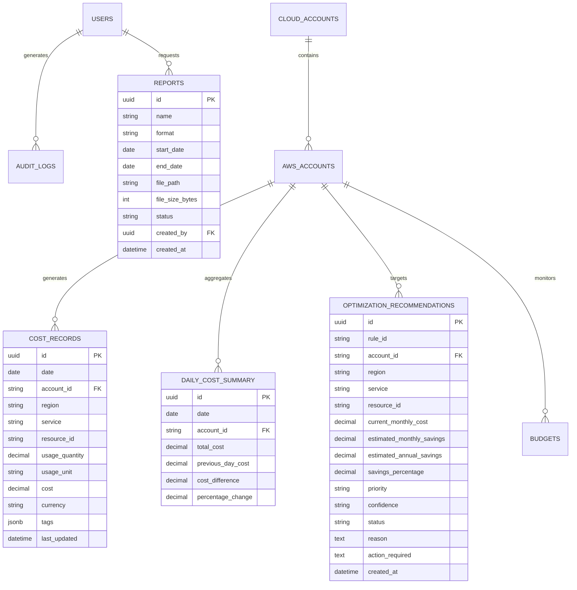

# Database Architecture & Schema Specification

## Overview

The platform uses **PostgreSQL 16** as its primary production relational database and **SQLAlchemy 2.0** as the ORM.

### Fundamental Principle: Strict Monetary Fidelity
Financial amounts are NEVER stored as floating-point numbers (`float`/`real`/`double precision`). All cost records and savings estimates use `NUMERIC(18, 4)` in SQL and Python's `decimal.Decimal`.

---

## Entity Relationship Model



---

## Primary Tables & Indexes

### 1. `cost_records`
Stores granular line-item costs fetched from AWS Cost Explorer or the Mock Provider:
- `id` (UUID, Primary Key)
- `date` (Date, Indexed)
- `account_id` (String(32), Indexed)
- `region` (String(32), Indexed)
- `service` (String(128), Indexed)
- `resource_id` (String(256), Nullable, Indexed)
- `usage_quantity` (Numeric(18, 4), Default 0)
- `usage_unit` (String(64), Nullable)
- `cost` (Numeric(18, 4), Not Null)
- `currency` (String(8), Default 'USD')
- `tags` (JSONB, Nullable)
- `metadata` (JSONB, Nullable)
- `idempotency_key` (String(128), Unique Index)

Composite indexes:
- `idx_cost_date_account_service` on `(date, account_id, service)`
- `idx_cost_account_date` on `(account_id, date)`

### 2. `daily_cost_summary`
Pre-aggregated rollups for instant dashboard loading without scanning millions of line items:
- `id` (UUID, Primary Key)
- `date` (Date, Indexed)
- `account_id` (String(32), Indexed)
- `total_cost` (Numeric(18, 4), Not Null)
- `previous_day_cost` (Numeric(18, 4), Default 0)
- `cost_difference` (Numeric(18, 4), Default 0)
- `percentage_change` (Numeric(8, 2), Default 0)

### 3. `optimization_recommendations`
Stores recommendations generated by the 11+ FinOps rules.
- Confidence: `Observed` | `Estimated` | `Potential`
- Status: `Requires validation` | `Insufficient data` | `Validated` | `Dismissed`
- Priority: `HIGH` | `MEDIUM` | `LOW`

### 4. `audit_logs`
Append-only log of critical operations:
- `id` (UUID, Primary Key)
- `user_id` (UUID, Nullable)
- `user_email` (String(255))
- `action` (String(64))
- `resource_type` (String(64))
- `resource_id` (String(128), Nullable)
- `ip_address` (String(64), Nullable)
- `metadata` (JSONB, Nullable - secrets strictly filtered)
- `created_at` (DateTime UTC)

---

## Schema Migrations (Alembic)

Migrations are managed via Alembic in `database/migrations/`:
```bash
# Apply pending migrations
alembic upgrade head

# Generate a new migration
alembic revision --autogenerate -m "add_column_name"
```

