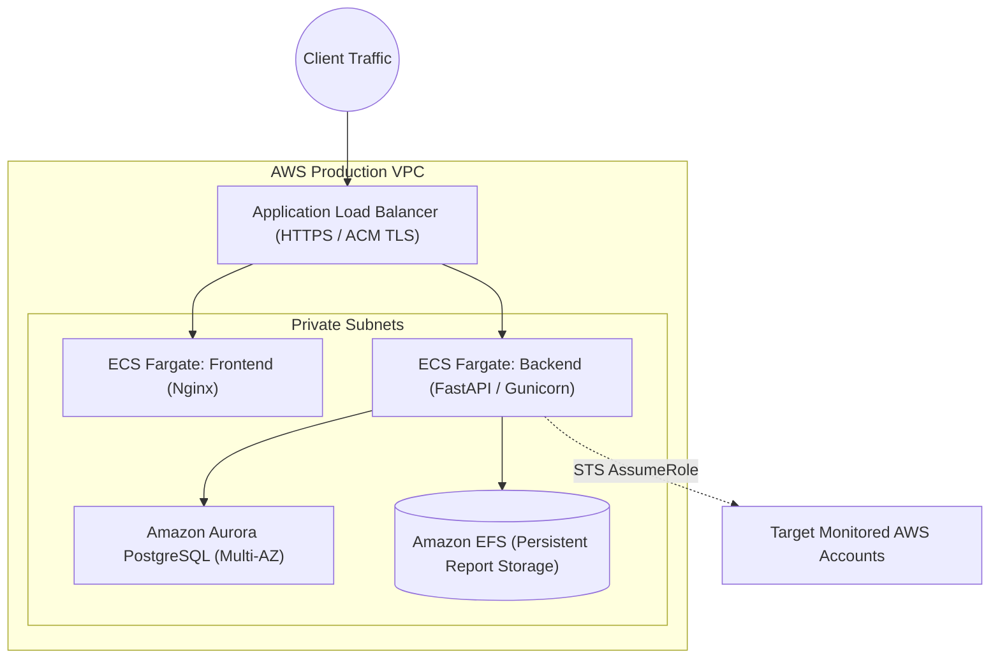

# Production Deployment Guide

## Overview

The platform can be deployed via Docker Compose for single-node setups, or orchestrated using AWS ECS Fargate or EKS for multi-node enterprise environments.

---

## Deployment Architectures

### Option A: Single-Node (Docker Compose)
Best for small to medium environments and private POCs.

```bash
# 1. Clone repository on server
git clone https://github.com/organization/cloud-cost-intelligence.git
cd cloud-cost-intelligence

# 2. Configure production environment
cp .env.example .env
# Edit .env: Set DEMO_MODE=false, strong SECRET_KEY, PostgreSQL credentials, AWS Role ARN

# 3. Launch with Docker Compose
docker compose up --build -d

# 4. Verify service health
curl -f http://localhost:8000/health
```

### Option B: Enterprise Cloud Architecture (AWS ECS Fargate)
For mission-critical production environments requiring high availability, automatic scaling, and least privilege security.



---

## Security Checklist Before Going Live

1. [ ] **Disable Demo Mode**: Set `DEMO_MODE=false` in the backend environment.
2. [ ] **Secret Key**: Generate a 32-byte cryptographic secret:
   ```bash
   python3 -c "import secrets; print(secrets.token_hex(32))"
   ```
3. [ ] **CORS Origins**: Limit `CORS_ORIGINS` to exact corporate domains (e.g. `https://finops.internal.company.com`).
4. [ ] **HTTPS / TLS**: Terminate TLS at the load balancer with TLS 1.3.
5. [ ] **Database Network Isolation**: Ensure PostgreSQL is deployed in a private subnet with no public IPv4 address.
6. [ ] **Scheduled Backup**: Enable daily snapshots for PostgreSQL and EFS report volume.

