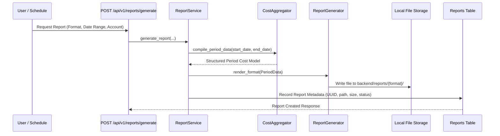

# Reporting Engine & Retention

## Overview

The reporting engine produces executive-ready cost reports in three formats:
1. **CSV**: Raw tabular breakdown for spreadsheet modeling and accounting imports.
2. **JSON**: Machine-readable payload for external automation and BI pipelines.
3. **HTML**: Clean, executive-ready, print-friendly report with KPI scorecards, charts, service tables, and optimization summaries.

---

## Report Directory Structure

Generated reports are persisted in the filesystem under `backend/reports/`:
```
backend/reports/
├── csv/          # Generated CSV reports
├── json/         # Generated JSON reports
├── html/         # Generated HTML reports
└── archive/      # Compressed archives of older reports
```
*(Note: Report files are excluded from git via `.gitignore`)*

---

## Report Generation Flow



---

## Automatic Report Retention & Cleanup

To prevent disk saturation in long-running deployments, the platform enforces `REPORT_RETENTION_DAYS=90`.
- Any report whose creation timestamp exceeds the retention period is automatically archived or removed during maintenance runs.
- The maintenance cleanup job can be executed manually:
  ```bash
  python backend/scripts/generate_report.py --cleanup --retention-days 90
  ```

